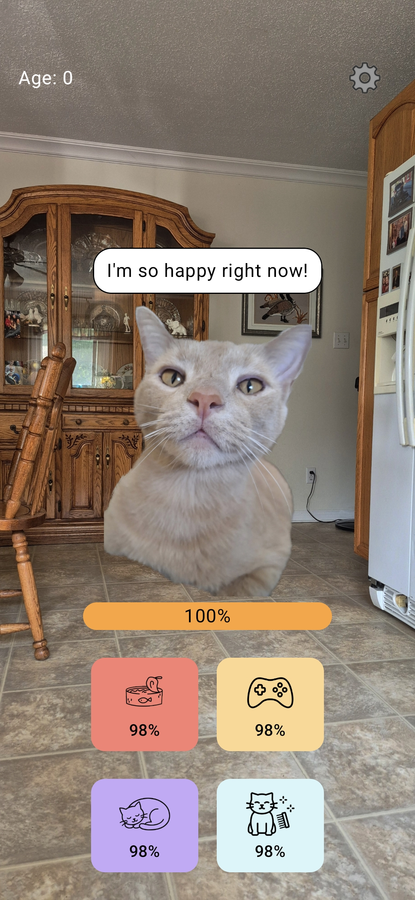
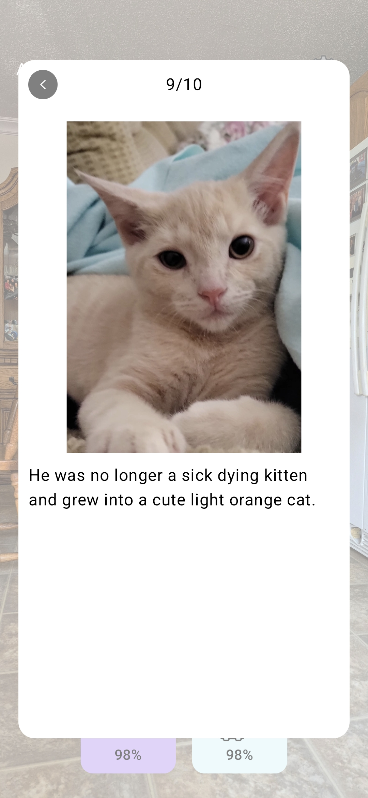
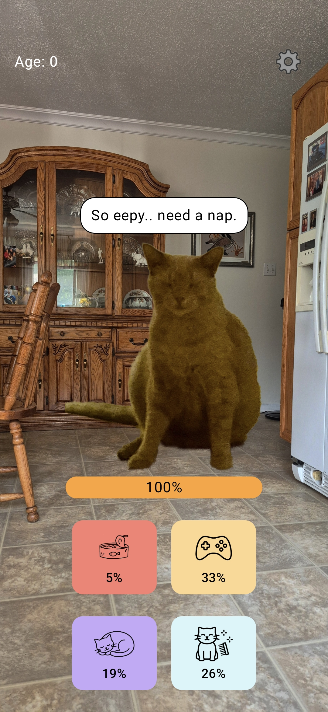

# Simba

This is a Tamagotchi android app featuring the greatest cat ever, Simba.

Play and take care of Simba.

This Android app follows MVVM architecture + Multiplatform Settings for the persistence

This currently runs on android, but I will be working towards IOS soon hopefully

## Features TODO
 - [x] Debug mode (requires some code or secret, this gives +- button for each stats)
 - [ ] Bundle game icon selection options to choose from
## Assets TODO
 - [ ] Remake action icons
   - [ ] Food
   - [ ] Play
   - [ ] Sleep
   - [ ] Clean