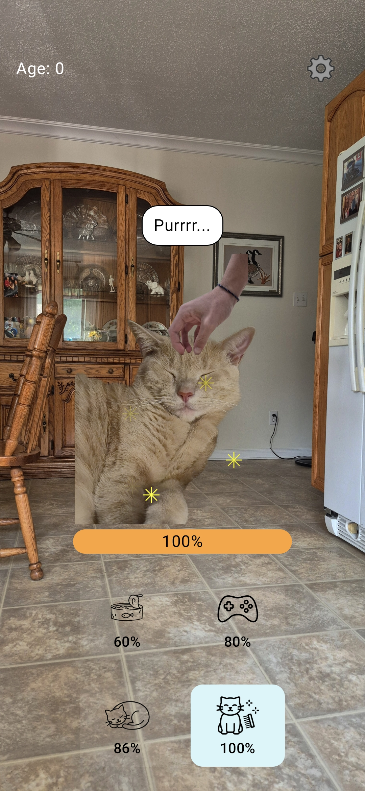

# Simba

This is a Tamagotchi android app featuring the greatest cat ever, Simba.

Play and take care of Simba.

  

## Built With
- Kotlin + Jetpack Compose
- MVVM architecture (View / ViewModel / Model)
- [Multiplatform Settings](https://github.com/russhwolf/multiplatform-settings) for persistence
- kotlinx.serialization

## Platform
- Currently Android only. iOS support via Kotlin Multiplatform is planned, not started yet.

## Features
- Interact with Simba with 4 action buttons
- You can pet Simba for 2+ seconds to gain happiness
- English/French available in the settings
- Gallery full of hidden used and unused Simba photos and assets
- You can rewatch the intro cutscene
- You can keep track of how long you've taken care of Simba given his age (in days)

## Download
- Sideloading required, must enable "install unknown apps"
- <a href="https://github.com/bicente44/Simba/raw/master/release/simba_v1.0.apk">Download APK</a>

## TODO
### Features
 - [ ] Bundle game icon selection options to choose from
### Assets
 - [ ] Remake action icons
   - [ ] Food
   - [ ] Play
   - [ ] Sleep
   - [ ] Clean
   - [ ] Implement the actual SFX and music assets
